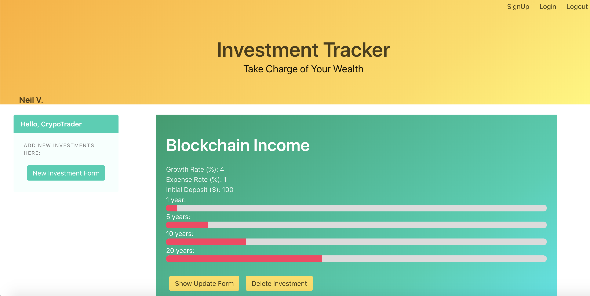

# Welcome to Investment Tracker by Neil V. 
## A RESTful REACT app to log your investments toward retirement.

## DEMO

[YouTube](https://youtu.be/xSD72C7lNJU)

## Blog

Link to Article:
[Medium](https://medium.com/@neilvseejoor/destructuring-with-objects-and-arrays-afb9540a5460)

# Getting Started
* Clone this repository
* cd into the project folder
* Run
`rake start`
* Enjoy!

# Authors
* **Neil V.** - *Initial work* - [Github](https://github.com/urbanvas)

# Links

[React Frontend](https://github.com/urbanvas/budget/tree/master/frontend)  
[LinkedIn](https://www.linkedin.com/in/neilvseejoor/)

## Contributing

Bug reports and pull requests are welcome on GitHub at https://github.com/urbanvas/budget. This project is intended to be a safe, welcoming space for collaboration, and contributors are expected to adhere to the [Contributor Covenant](http://contributor-covenant.org) code of conduct.

## License

The app is available as open source under the terms of the [MIT License](https://opensource.org/licenses/MIT).

## Code of Conduct

Everyone interacting in the InvestmentTrackers project’s codebases, issue trackers, chat rooms and mailing lists is expected to follow the code of conduct.
